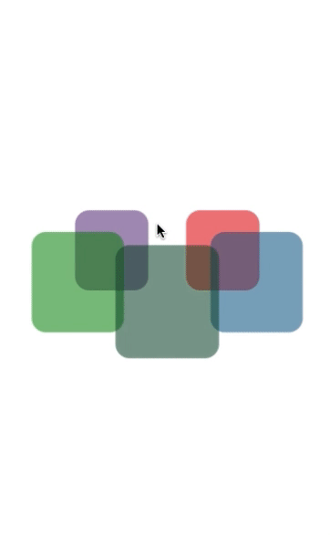

# Carousel - React Native Library

Created by Shamshad Khan on 20/09/18.
Copyright © 2018 Shamshad Khan. All rights reserved.

Provide following properties as props to customise the carousel

  - dataSource' type, -> [{ url, color}] 
      
    - 'url' is web url of image
    - 'color' is hex color code

  - 'onItemPress', method is called when the front item is clicked,
     the clicked item index returned as result.

  - 'containerDim' -> to set carosel height, width etc default is 350, 200 respectively

  - 'itemDim' -> to set item height, width etc default is 100, 110 respectively

  - 'radius' -> to set rotation radius of carousel, default is 100

The carousel can also update dynamically on updating props like radius, dataSource, containerDims, itemDims.

#
#
# Demo

